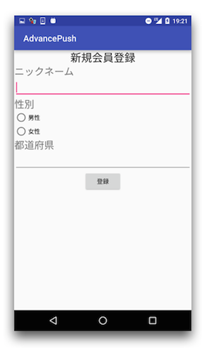

name: inverse
layout: true
class: center, middle, inverse
---
# <span style="font-size: 30%">【Android編】</span><br><span style="font-size: 88%">プッシュ通知を活用して<br>__クーポン配信アプリを作ろう__</span>

@ncmbadmin

.footnote[
201701作成
]
---
layout: false
## 事前準備（確認）
ニフティクラウドmobile backendのアカウント登録がお済みでしょうか？<br>
[ホームページ](http://mb.cloud.nifty.com/about.htm)右上にある「無料登録」ボタンをクリックして、<br>
アカウント登録を実施してください


---
layout: false
## 事前準備（確認）

以下の事前準備を行いましたでしょうか <br>


---
## 今回のハンズオンセミナーについて
### セミナーの形式


  講義形式で説明と演習を繰り返してアプリを作成します.<br>
  用意したコードからコピペで実装を行い、実装完了してから動作確認します。<br>
  途中で確認ポイントいくつか用意しています。休憩も合わせてとります。
  <br><br><br>
  

---
## 今回のハンズオンセミナーについて
### 学ぶ内容

「mBaaS Shop List」アプリの作成を通して、アクティブユーザー率を上げる<br>
効率的なプッシュ通知の組み込み方を学びます

.center[

]

---
## 今回のハンズオンセミナーについて
### 学ぶ内容

「mBaaS Shop List」アプリの作成を通して、アクティブユーザー率を上げる<br>
効率的なプッシュ通知の組み込み方を学びます<br>

.center[

]

---
## ニフティクラウド mobile backendとは
### サービス紹介

* スマホアプリで汎用的に実装される機能を、クラウドサービスとして提供しているサービスです
 * 通称「mBaaS」と呼びます

.center[

]

---
## ニフティクラウド mobile backendとは
### Android SDKの特徴

* SDKのインストールが必要です
 * 今回は実装済み
 * 参考：[クイックスタート](http://mb.cloud.nifty.com/doc/current/introduction/quickstart_android.html)
* SDKの初期化処理が必要です
 * 後で処理を実装します

```java
NCMB.initialize(this.getApplicationContext(),"APP_KEY","CLIENT_KEY");
```

---
## ニフティクラウド mobile backendとは
### Android SDKの特徴

* サーバへリクエスト処理には、__同期処理__と__非同期処理__があります

```java

// 例）保存の場合
/* 同期処理 */

NCMBObject obj = new NCMBObject("SaveObjectTest");
obj.put("key", "value");
obj.save();

```

---
## ニフティクラウド mobile backendとは
### Android SDKの特徴

* サーバへリクエスト処理には、__同期処理__と__非同期処理__があります

```java
/* 非同期処理 */

NCMBObject obj = new NCMBObject("SaveObjectTest");
obj.put("key", "value");
obj.saveInBackground(new DoneCallback() {
    @Override
    public void done(NCMBException e) {
        if (e != null) {
            //エラー発生時の処理
        } else {
            //成功時の処理
        }
    }
});

```

* 同期処理と非同期処理
 * 同期処理はその処理が完了するまで、次の処理が実行されません
 * 非同期処理はバックグラウンドで処理を実行し、次の処理を実行します DoneCallback()にて処理後の実装を事前に指定できます

---
## ハンズオンの概要
### 作成するアプリについて

* クーポン配信アプリをイメージした「mBaaS Shop List」アプリの作成を通して、mBaaSの機能を理解していきます
* mBaaSの連携部分をコーディングし、アプリを完成させ、次の内容を実現していきます
 * 会員登録をするとお店情報を見ることができます
 * お店のお気に入り登録ができ、お気に入り登録をしたお店からプッシュ通知で届きます
 * 性別や都道府県限定のプッシュ通知ができます
 * お店からのプッシュ通知でクーポンを直接配信することができます
 * 決まった時間に通知を出すようにプッシュ通知を仕掛けることができます

---
## ハンズオンの概要
### 作成するアプリについて

.center[

]

---
## ハンズオンの流れ

__<font color="#49a7e5" size="5">前半&nbsp;</font><font size="6">「mBaaS Shop List」アプリを作ろう！</font>__

.size_large[
1. ハンズオンの準備
1. 会員管理機能の作成
1. Shop情報の設定
1. お気に入り機能の作成
]

__<font color="#49a7e5" size="5">後半&nbsp;</font><font size="6">プッシュ通知を送ろう！</font>__
.size_large[
1. プッシュ通知の準備
1. プッシュ通知を送信：セグメント配信
1. プッシュ通知を送信：リッチプッシュ
]

---
layout: true
class: center, middle, inverse_sub
---
#「mBaaS Shop List」<br>アプリを作ろう！

.size_large[
＜前半＞
]

---
layout: true
class: center, middle, inverse
---
# 1.ハンズオンの準備

---
layout: false
## ハンズオンの準備
### プロジェクトをダウンロード

下記リンクをクリックして、ZIPファイルでダウンロードしてください▼<br>
.size_large[
　　　 __[AndroidAdvancePush](https://github.com/ncmbadmin/AndroidAdvancePush/archive/handson.zip)__
]

* zipファイルを展開します。
* AndroidStudioで先ほどダウンロードしたプロジェクトを開いてください。

.center[

]

---
layout: false
## ハンズオンの準備
### プロジェクトを準備

* AndroidStudioでプロジェクトのビューを調整します。
  - 左上のビューオプション項目で[Android]を選択します。

.center[

]

---
layout: false
## ハンズオンの準備
### プロジェクトを準備

* AndroidStudioでプロジェクトのファイル構成を確認します。
  - 以下のように処理のファイルが入っていることをご確認ください。

.center[

]

---
## ハンズオンの準備
### プロジェクトにあらかじめ実施していること

* mBaaS Android SDK v.2.2.3のインストール, build.graddleの設定, AndroidManifestの設定は実装済み
* mBaaSとの連携以外の処理のコーディング
 * アプリのデザインを`layoutフォルダー内ファイル`で作成し、処理は画面ごと`Activityのファイル`にコーディングしています

---
## ハンズオンの準備
### mBaaSの準備

* [mBaaS](http://mb.cloud.nifty.com)にログインしてアプリを作成します


---
## ハンズオンの準備
### APIキーの設定とSDKの初期化

* `MainActivity.java`を開きます
* `onCreate()`メソッド内に処理を実装します[一部実装済み]

```java
//**************** 【mBaaS/Initialization: APIキーを指定する】***************
NCMB.initialize(this.getApplicationContext(),"APP_KEY","CLIENT_KEY");
```

---
## ハンズオンの準備
### APIキーの設定とSDKの初期化

* 初期化処理の「`APP_KEY`」，「`CLIENT_KEY`」の部分をアプリ作成時に発行されたAPIキーに書き換えてください
 * APIキーは、mBaaSのダッシュボードから「アプリ設定」→「基本」にあります

.center[

]

---
layout: true
class: center, middle, inverse
---
# 2.会員管理機能の作成

---
layout: false
## 会員管理機能の作成
### mBaaSの設定

* 会員管理設定の「メールアドレス/パスワード認証」を許可します


---
## 会員管理機能の作成

### 会員管理①：会員登録用メールを要求する[実装済み]

.center[

]

---
## 会員管理機能の作成
### 会員管理①：会員登録用メールを要求する[実装済み]

* `SignupActivity.java`を開きます
* `doSignupByEmail()`メソッドを開きます
* 会員登録処理は以下のように実装されます

```java
//**************** 【mBaaS/User①】: 会員登録用メールを要求する】***************
String email = _signupEmail.getText().toString();
NCMBUser.requestAuthenticationMailInBackground(email, new DoneCallback() {
     @Override
     public void done(NCMBException e) {
         if (e != null) {
             // 会員登録用メールの要求失敗時の処理
         } else {
             // 会員登録用メールの要求成功時の処理
         }
     }
 });
```

---
## 会員管理機能の作成
### 会員管理①：会員登録用メールを要求する[実装済み]

* それぞれ処理を追記しています

```java
// 会員登録用メールの要求失敗時の処理
new AlertDialog.Builder(SignupActivity.this)
        .setTitle("Notification from Nifty")
        .setMessage("Send failed! Error:" + e.getMessage())
        .setPositiveButton("OK", null)
        .show();
```

```java
// 会員登録用メールの要求成功時の処理
new AlertDialog.Builder(SignupActivity.this)
        .setTitle("Notification from Nifty")
        .setMessage("メール送信完了しました! メールをご確認ください。")
        .setPositiveButton("OK", new DialogInterface.OnClickListener() {
            public void onClick(DialogInterface dialog, int which) {
                //Login画面遷移します
                Intent intent = new Intent(getApplicationContext(), LoginActivity.class);
                startActivityForResult(intent, REQUEST_RESULT);
            }
        })
        .show();
```
---
## 会員管理機能の作成
### 会員管理②：メールアドレスとパスワードでログイン<br>[実装済み]

.center[

]

---
## 会員管理機能の作成
### 会員管理②：メールアドレスとパスワードでログイン<br>[実装済み]

* `LoginActivity.java`を開きます
* `doLogin()`メソッドを開きます
* ログイン処理は以下のように実装されます

```java
//**************** 【mBaaS/User②】: メールアドレスとパスワードでログイン】***************
String email = _loginEmail.getText().toString();
String password = _loginPassword.getText().toString();

NCMBUser.loginWithMailAddressInBackground(email, password, new LoginCallback() {
    @Override
    public void done(NCMBUser user, NCMBException e) {
        if (e != null) {
            //ログインに失敗した場合の処理
        } else {
            //ログインに成功した場合の処理
        }
    }
});
```

---
## 会員管理機能の作成
### 会員管理②：メールアドレスとパスワードでログイン<br>[実装済み]

* それぞれ処理を追記しています

```java
//ログインに失敗した場合の処理
new AlertDialog.Builder(LoginActivity.this)
        .setTitle("Notification from Nifty")
        .setMessage("Login failed! Error:" + e.getMessage())
        .setPositiveButton("OK", null)
        .show();
```

---
## 会員管理機能の作成
### 会員管理②：メールアドレスとパスワードでログイン<br>[実装済み]

* それぞれ処理を追記しています（続き）

```java
//ログインに成功した場合の処理
common.currentUser = NCMBUser.getCurrentUser();
AlertDialog show = new AlertDialog.Builder(LoginActivity.this)
        .setTitle("Notification from Nifty")
        .setMessage("ログイン成功")
        .setPositiveButton("OK", new DialogInterface.OnClickListener() {
            public void onClick(DialogInterface dialog, int which) {
                String nickname = common.currentUser.getString("nickname");
                if (nickname != null && !nickname.isEmpty() && !nickname.equals("null")) {
                    //メイン画面遷移します
                    Intent intent = new Intent(getApplicationContext(), MainActivity.class);
                    startActivityForResult(intent, REQUEST_RESULT);
                } else {
                    //初期ログイン会員登録画面遷移します
                    Toast.makeText(LoginActivity.this, "Register user information for the first time!", Toast.LENGTH_LONG).show();
                    Intent intent = new Intent(getApplicationContext(), RegisterActivity.class);
                    startActivityForResult(intent, REQUEST_RESULT);
                }
            }
        })
        .show();
```

---
## 会員管理機能の作成
### 動作確認(1)ログインをしてみましょう

* ここではシュミレーターでビルドし、動作確認を行います
* ログイン画面で「会員登録」をタップします
* 会員登録画面でメールアドレスを入力し「登録メールを送信」をタップします
 * メッセージを確認してください
 * エラーが発生したらここを見てください。
 [エラーコード一覧](http://mb.cloud.nifty.com/doc/current/rest/common/error.html#REST%20API%E3%81%AE%E3%82%A8%E3%83%A9%E3%83%BC%E3%82%B3%E3%83%BC%E3%83%89%E3%81%AB%E3%81%A4%E3%81%84%E3%81%A6)

---
## 会員管理機能の作成
### 動作確認(1)ログインをしてみましょう

.center[

]

---
## 会員管理機能の作成
### 動作確認(1)ログインをしてみましょう

* 会員登録メールが届くので、パスワード設定します

.center[

]

---
## 会員管理機能の作成
### 動作確認(1)ログインをしてみましょう

* 再びログイン画面に戻り「メールアドレス」と「パスワード」でログインします
 * ログを確認してください
* mBaaSのダッシュボードを確認してください
 * 会員管理にユーザーが登録されました

.center[

]
.footnote[
[エラーコード一覧](http://mb.cloud.nifty.com/doc/current/rest/common/error.html#REST%20API%E3%81%AE%E3%82%A8%E3%83%A9%E3%83%BC%E3%82%B3%E3%83%BC%E3%83%89%E3%81%AB%E3%81%A4%E3%81%84%E3%81%A6)
]

---
## 会員管理機能の作成
### 会員管理③：ユーザー情報更新

.center[

]

---
## 会員管理機能の作成
### 会員管理③：ユーザー情報更新


* `RegisterActivity.java`を開きます
* `doRegister()`を開きます
* 初回のみ表示されるユーザー情報登録画面に入力した情報をmBaaSのユーザー情報に追加する処理を実装します
* コメントの下にコードを追記していきます

```java
//**************** 【mBaaS/User③: ユーザー情報更新】***************


```

* かなり下の方にあります

---
## 会員管理機能の作成
### 会員管理③：ユーザー情報更新

```java
//**************** 【mBaaS/User③: ユーザー情報更新】***************
common.currentUser.put("nickname", nickname);
common.currentUser.put("prefecture", prefecture);
common.currentUser.put("gender", selectedGender);
common.currentUser.put("favorite",list);

common.currentUser.saveInBackground(new DoneCallback() {
    @Override
    public void done(NCMBException e) {
        if (e != null) {
            // 更新失敗時の処理

        } else {
            // 更新成功時の処理

        }
    }
});

```

---
## 会員管理機能の作成
### 会員管理③：ユーザー情報更新

* それぞれ処理を追記します

```java
// 更新失敗時の処理
new AlertDialog.Builder(RegisterActivity.this)
        .setTitle("Notification from Nifty")
        .setMessage("Save failed! Error:" + e.getMessage())
        .setPositiveButton("OK", null)
        .show();
```

```java
// 更新成功時の処理
new AlertDialog.Builder(RegisterActivity.this)
       .setTitle("Notification from Nifty")
       .setMessage("保存成功しました! 入力ありがとうございます")
       .setPositiveButton("OK", new DialogInterface.OnClickListener() {
           public void onClick(DialogInterface dialog, int which) {
               Intent intent = new Intent(getApplicationContext(), MainActivity.class);
               startActivityForResult(intent, REQUEST_RESULT );
           }
       })
       .show();
```

---
layout: true
class: center, middle, inverse
---
# 3.Shop情報の設定

---
layout: false
## Shop情報の設定
### mBaaSにShop情報を用意する（データストア）

* ニフティクラウド mobile backendのダッシュボードから「データストア」を開き、「＋作成▼」ボタンをクリックし、「インポート」をクリックします
* クラス名に「__Shop__」と入力します
* ダウンロードしたサンプルプロジェクトにあるSettingフォルダ内の「__Shop.json__」を選択してアップロードします

.center[

]

---
## Shop情報の設定
### mBaaSにShop情報を用意する（データストア）

こんな感じでインポートされます

.center[

]

---
## Shop情報の設定
### mBaaSにShop情報を用意する（ファイルストア）

* ニフティクラウド mobile backendのダッシュボードから「ファイルストア」を開き、「↑アップロード」ボタンをクリックします
* ダウンロードしたサンプルプロジェクトにあるSettingフォルダ内の「icon」「Shop」「Sale」内にあるファイルをすべてをアップロードします

.center[

]

---
## Shop情報の設定
### mBaaSにShop情報を用意する（ファイルストア）

* こんな感じでアップロードされます

.center[

]

---
## Shop情報の設定
### データストア：「Shop」クラスのデータを取得

* `MainActivity.java`を開きます
* `doLoadShop()`を開きます
* インポートしたShopクラスのデータを取得する処理を実装します
  - コメントの下にコードを追記していきます

```java
//**************** 【mBaaS/Shop①: 「Shop」クラスのデータを取得】***************


```

---
## Shop情報の設定
### データストア：「Shop」クラスのデータを取得

```java
//**************** 【mBaaS/Shop①: 「Shop」クラスのデータを取得】***************
// 「Shop」クラスのクエリを作成
NCMBQuery<NCMBObject> query = new NCMBQuery<>("Shop");
//データストアからデータを検索
List<NCMBObject> results = query.find();
//グローバル変数を更新する
common.shops = results;
ListView lv = (ListView) findViewById(R.id.lstShop);
lv.setAdapter(new ShopListAdapter(this, results));
```


---
## Shop情報の設定
### ファイルストア①：icon画像の取得

.center[

]

---
## Shop情報の設定
### ファイルストア①：icon画像の取得

* `ShopListAdapter.java`を開きます
 * `ShopListAdapter.java`はリストの項目を作成するファイルです
* トップ画面に各ショップのアイコンをmBaaSから取得して表示する処理を実装します
- コメントの下にコードを追記していきます

```java
////**************** 【mBaaS/File①: ショップ画像を取得】***************


```

---
## Shop情報の設定
### ファイルストア①：icon画像の取得


```java
//**************** 【mBaaS/File①: ショップ画像を取得】***************
NCMBFile file = new NCMBFile(filename);
file.fetchInBackground(new FetchFileCallback() {
    @Override
    public void done(byte[] data, NCMBException e) {
        if (e != null) {
            // 取得失敗時の処理
        } else {
            // 取得成功時の処理
        }
    }
});
```

---
## Shop情報の設定
### ファイルストア①：icon画像の取得

* それぞれ処理を追記します

```java
// 取得失敗時の処理
Log.d(TAG, e.getMessage());
```

```java
// 取得成功時の処理
Bitmap bmp = null;
if (data != null) {
    bmp = BitmapFactory.decodeByteArray(data, 0, data.length);
}
holder.img.setImageBitmap(bmp);
```

---
## Shop情報の設定
### ファイルストア②：Shop画像の取得

.center[

]

---
## Shop情報の設定
### ファイルストア②：Shop画像の取得[実装済み]

* `ShopActivity.java`を開きます
* `onCreate()`を開きます
* Shop画面に各ショップの画像をmBaaSから取得して表示する処理も同様に実装できます


```java

//**************** 【mBaaS/File②: ショップ詳細画像を取得】***************
NCMBFile file = new NCMBFile(shop_image);
file.fetchInBackground(new FetchFileCallback() {
    @Override
    public void done(byte[] data, NCMBException e) {
        if (e != null) {
            //取得失敗時の処理
            Log.d(TAG, e.getMessage());
        } else {
            //取得成功時の処理
            Bitmap bmp = null;
            if (data != null) {
                bmp = BitmapFactory.decodeByteArray(data, 0, data.length);
            }
            _shop_image.setImageBitmap(bmp);
        }
    }
});
```

---
## Shop情報の設定
### 動作確認(2)会員情報登録とShop情報表示

* 再びシュミレーターでビルドし、動作確認を行います
* ログイン後初回のみ、ユーザー情報登録画面が表示されます
* 入力し「登録」をタップします
 * このとき、会員情報が更新されますので、mBaaSのダッシュボードを確認してみましょう
 * ログを確認してください

.center[

]
.footnote[
[エラーコード一覧](http://mb.cloud.nifty.com/doc/current/rest/common/error.html#REST%20API%E3%81%AE%E3%82%A8%E3%83%A9%E3%83%BC%E3%82%B3%E3%83%BC%E3%83%89%E3%81%AB%E3%81%A4%E3%81%84%E3%81%A6)
]

---
## Shop情報の設定
### 動作確認(2)会員情報登録とShop情報表示

* トップ画面に「icon画像」「Shop名」「カテゴリ」が表示されます
* Shopを１つ選んでタップします
 * mBaaSに登録されているimageにアクセスし、Shopページ（画像）が表示されます
* 会員ページをタップします
 * ユーザー情報が表示されます

.center[

]
.footnote[
[エラーコード一覧](http://mb.cloud.nifty.com/doc/current/rest/common/error.html#REST%20API%E3%81%AE%E3%82%A8%E3%83%A9%E3%83%BC%E3%82%B3%E3%83%BC%E3%83%89%E3%81%AB%E3%81%A4%E3%81%84%E3%81%A6)
]

---
layout: true
class: center, middle, inverse
---
# 4.お気に入り機能の作成

---
layout: false
## お気に入り機能の作成
### お気に入り機能について

* お気に入り機能は好きなShopをお気に入りとして保存できる機能です
 * 「お気に入り」画面ではSwitchと「登録」ボタンで設定します
 * 「Shop」画面では「お気に入りを登録する」をタップすることでShop単位で設定できます

.center[

]

---
## お気に入り機能の作成
### 会員管理④：ユーザー情報の更新[実装済み]

* `FavoriteActivity.java`を開きます
* `doFavoriteSave()`を開きます
* お気に入り画面からfavoriteデータの更新処理はユーザー情報の登録と同様にして実装できます

---
## お気に入り機能の作成
### 会員管理④：ユーザー情報の更新[実装済み]


```java
//**************** 【mBaaS/User ④: 会員情報更新】***************
List<String> list = new ArrayList<String>();
list = common.currentUser.getList("favorite");
common.currentUser.put("favorite", list);
common.currentUser.saveInBackground(new DoneCallback() {
    @Override
    public void done(NCMBException e) {
        if (e != null) {
            //保存失敗時の処理
            <<省略>>
        } else {
            //保存成功時の処理
            new AlertDialog.Builder(FavoriteActivity.this)
                    .setTitle("Notification from Nifty")
                    .setMessage("お気に入り保存成功しました!")
                    .setPositiveButton("OK", new DialogInterface.OnClickListener() {
                        public void onClick(DialogInterface dialog, int which) {
                            Intent intent = new Intent(getApplicationContext(), FavoriteActivity.class);
                            startActivityForResult(intent, REQUEST_RESULT);
                        }
                    })
                    .show();
        }
    }
});
```

---
## お気に入り機能の作成

### 会員管理⑤：ユーザー情報の更新[実装済み]

* `ShopActivity.java`を開きます
* `doFavoriteRegister()`を開きます
* Shop画面からもfavoriteデータの更新処理はユーザー情報の登録と同様にして実装できます

---
## お気に入り機能の作成

### 会員管理⑤：ユーザー情報の更新[実装済み]


```java
//**************** 【mBaaS/User⑤: 会員情報更新】***************
List<String> list = new ArrayList<String>();
list = common.currentUser.getList("favorite");
list.add(objId);
common.currentUser.put("favorite", list);
common.currentUser.saveInBackground(new DoneCallback() {
    @Override
    public void done(NCMBException e) {
        if (e != null) {
            //更新失敗時の処理
            <<省略>>
        } else {
            //更新成功時の処理
          　<<省略>>
        }
    }
});
```

---
## お気に入り機能の作成
### 動作確認(3)お気に入り情報登録・更新

* 再びシュミレーターでビルドし、動作確認を行います
* ログイン後トップ画面下の「お気に入り」をタップします
* お気に入り画面からお気に入り登録をしてみましょう
* 各Shop画面からも同様に登録してみましょう
 * ログを確認してください

.center[

]

.footnote[
[エラーコード一覧](http://mb.cloud.nifty.com/doc/current/rest/common/error.html#REST%20API%E3%81%AE%E3%82%A8%E3%83%A9%E3%83%BC%E3%82%B3%E3%83%BC%E3%83%89%E3%81%AB%E3%81%A4%E3%81%84%E3%81%A6)
]

---
layout: true
class: center, middle, inverse_sub
---
# プッシュ通知を送ろう！

.size_large[
＜後半＞
]

---
layout: true
class: center, middle, inverse
---
# 1.プッシュ通知の準備

---
layout: false
## プッシュ通知の準備
### このあとのデバッグについて

* 以下の用意が必要です
 * デバッグ用のAndroid実機 (4.0~)
 * FCMのプッシュ通知用APIキー
* FCMのプッシュ通知用APIキーがまだの場合は下記をご参照ください
 * [【サンプル】アプリにプッシュ通知を組み込もう！](https://github.com/NIFTYCloud-mbaas/android_push_demo#%E6%89%8B%E9%A0%86)
*  FCMはGCM(Google Cloud Messaging)の新バージョンです。既にGCMにてプロジェクトの作成・GCMの有効化設定を終えている場合は、継続してご利用いただくことが可能です。

---
## プッシュ通知の準備
### mBaaSの設定

* プッシュ通知の許可を行います
* FCM/GCMのプッシュ通知用APIキーを設定します

.center[

]

---
## プッシュ通知の準備
### プッシュ通知①：端末を登録

* `MainActivity.java`を開きます
* `onCreate()`メソッド内のSDKの初期化を実装した部分の直ぐ下に処理を実装します

```java
//**************** 【mBaaS/Push①: 端末を登録】***************

```

---
## プッシュ通知の準備
### プッシュ通知①：端末を登録

```java
//**************** 【mBaaS/Push①: 端末を登録】***************
//端末情報を扱うNCMBInstallationのインスタンスを作成する
final NCMBInstallation installation = NCMBInstallation.getCurrentInstallation();
//FCMからRegistrationIdを取得しinstallationに設定する
installation.getRegistrationIdInBackground("SENDER_ID", new DoneCallback() {
    @Override
    public void done(NCMBException e) {
        if (e == null) {
            installation.saveInBackground(new DoneCallback() {
                @Override
                public void done(NCMBException e) {
                    if(e == null){
                        Log.d(TAG, "端末情報を保存成功しました。");
                    }else if(NCMBException.DUPLICATE_VALUE.equals(e.getCode())){
                        //保存失敗 : registrationID重複
                        updateInstallation(installation);
                    }else {
                        Log.d(TAG, "端末情報を保存失敗しました。");
                    }
                }
            });
        } else {
        }
    }
});
```

---
## プッシュ通知の準備
### プッシュ通知①：端末を登録

* 前のスライドのコードにある`SENDER_ID`の設定を行います。

.center[

]

---
layout: true
class: center, middle, inverse
---
# 2.プッシュ通知を送信<br>セグメント配信

---
layout: false
## プッシュ通知を送信：セグメント配信
### プッシュ通知②：installationにユーザー情報を紐づける

* `RegisterActivity.java`を開きます
* 「【mBaaS/User③: ユーザー情報更新】」の更新成功時の処理内にセグメント配信のために必要なユーザー情報をinstallationに紐付けるための処理を実装します


```java
//**************** 【mBaaS：プッシュ通知②】installationにユーザー情報を紐づける ***************

```

---
## プッシュ通知を送信：セグメント配信
### プッシュ通知②：installationにユーザー情報を紐づける

* 次のように追記します

```java
//**************** 【mBaaS：プッシュ通知②】installationにユーザー情報を紐づける ***************
NCMBInstallation currInstallation  = NCMBInstallation.getCurrentInstallation();
currInstallation.put("prefecture", prefecture);
currInstallation.put("gender", selectedGender);
currInstallation.put("favorite", list);
currInstallation.saveInBackground(new DoneCallback() {
    @Override
    public void done(NCMBException e) {
        if (e != null) {
            //更新失敗時の処理
        } else {
            //更新成功時の処理
        }
    }
});
```

---
## プッシュ通知を送信：セグメント配信
### プッシュ通知②：installationにユーザー情報を紐づける

* それぞれ処理を追記します

```java
//更新失敗時の処理
Log.d(TAG, "端末情報を保存失敗しました。");
```

```java
//更新成功時の処理
Log.d(TAG, "端末情報を保存成功しました。");
Intent intent = new Intent(getApplicationContext(), MainActivity.class);
startActivityForResult(intent, REQUEST_RESULT );
```

---
## プッシュ通知を送信：セグメント配信
### プッシュ通知③：installationにユーザー情報を紐づける<br>[実装済み]

* `FavoriteActivity.java`開きます
* `doFavoriteSave()`を開きます
* 同様に、お気に入り画面でお気に入り情報が更新されるたびに、installation情報が書き換えられます

```java
//**************** 【mBaaS：プッシュ通知④】installationにユーザー情報を紐づける***************
//端末情報を保存する
NCMBInstallation currInstallation = NCMBInstallation.getCurrentInstallation();
currInstallation.put("favorite", list);
currInstallation.saveInBackground(new DoneCallback() {
    @Override
    public void done(NCMBException e) {
        if (e != null) {
            //保存失敗
            Log.d(TAG, "端末情報を保存失敗しました。");
        } else {
            //保存成功
            Log.d(TAG, "端末情報を保存成功しました。");
        }
    }
});
```

---
## プッシュ通知を送信：セグメント配信
### プッシュ通知④：installationにユーザー情報を紐づける<br>[実装済み]

* `ShopActivity.java`開きます
* `doFavoriteRegister()`開きます
* 同様に、Shop画面でもお気に入り情報が更新されるたびに、installation情報が書き換えられます

```java
//****************【mBaaS：プッシュ通知⑤】installationにユーザー情報を紐づける***************
NCMBInstallation currInstallation  = NCMBInstallation.getCurrentInstallation();
currInstallation.put("favorite", list);
currInstallation.saveInBackground(new DoneCallback() {
    @Override
    public void done(NCMBException e) {
        if (e != null) {
            //保存失敗した場合の処理
            Log.d(TAG, "端末情報を保存失敗しました。");
        } else {
            //保存成功した場合の処理
            Log.d(TAG, "端末情報を保存成功しました。");
        }
    }
});
```
---
## プッシュ通知を送信：セグメント配信
### 動作確認の準備

* もう一度会員情報登録画面を表示するため、mBaaSの会員管理画面で「クラスの編集」をクリックします
* 「nickname」にチェックを入れて上の「削除」ボタンで削除します

.center[

]

---
## プッシュ通知を送信：セグメント配信
### 動作確認の準備

* 実機でアプリをビルドします
* アプリを起動します

```text
端末情報を保存成功しました。
```

* デバイストークンの取得に成功したら、mBaaSダッシュボードで確認します

.center[

]

.footnote[
[エラーコード一覧](http://mb.cloud.nifty.com/doc/current/rest/common/error.html#REST%20API%E3%81%AE%E3%82%A8%E3%83%A9%E3%83%BC%E3%82%B3%E3%83%BC%E3%83%89%E3%81%AB%E3%81%A4%E3%81%84%E3%81%A6)
]

---
## プッシュ通知を送信：セグメント配信
### 動作確認の準備

* ログインをし、再びユーザー登録をします
 * このとき、installationが更新されますのでダッシュボードを確認します
 * ログを確認してください

.center[

]
.footnote[
[エラーコード一覧](http://mb.cloud.nifty.com/doc/current/rest/common/error.html#REST%20API%E3%81%AE%E3%82%A8%E3%83%A9%E3%83%BC%E3%82%B3%E3%83%BC%E3%83%89%E3%81%AB%E3%81%A4%E3%81%84%E3%81%A6)
]

---
## プッシュ通知を送信：セグメント配信
### 動作確認(4)セグメント配信

__shopB__をお気に入り登録しているユーザーに絞り込んでプッシュ通知を配信してみましょう！

* あらかじめshopBをお気に入りに設定しておきます(アプリ側)
* mBaaSのダッシュボードからShopクラスのデータを開き、shopBの「objectId」をコピーします

.center[

]

---
## プッシュ通知を送信：セグメント配信
### 動作確認(4)セグメント配信

* プッシュ通知を作成します
* メッセージを入力します
 * 例：ShopBセール開催中！
* 「Android端末に配信する」にチェックを入れます
* 「配信端末」を設定します

.center[

]

---
## プッシュ通知を送信：セグメント配信
### 動作確認(4)セグメント配信

* 「installationクラスからの絞込み」を選択します
* 絞り込み設定をします
 * ここでコピーしたShopBのobjectIdを貼り付けます

.center[

]

---
## プッシュ通知を送信：セグメント配信
### 動作確認(4)セグメント配信

* 「１端末に向けて送信されます」と表示されればOKです
* 「プッシュ通知を作成する」をクリックします
* 少し待つと配信されます→端末を確認！

.center[

]

---
## プッシュ通知を送信：セグメント配信
### 動作確認(4)セグメント配信[おまけ]

.size_large[
いろいろなパターンで送ってみましょう！
* 別のショップを絞り込み
* 性別で絞込み
* ShopAをお気に入り登録かつ女性で絞込み
* ShopDをお気に入り登録かつ東京都で絞込み
* and more...
]

---
layout: true
class: center, middle, inverse
---
# 2.プッシュ通知を送信<br>リッチプッシュ

---
layout: false

## プッシュ通知を送信：リッチプッシュ
### リッチプッシュについて

* プッシュ通知登録時にURLを指定することで、開封時にWebビューを表示できる機能です
* プッシュ通知開封でアプリが起動するときに表示されます
 * アプリ起動中には表示されませんので動作確認にはアプリを閉じておく必要があります（仕様）

---
## プッシュ通知を送信：リッチプッシュ
### リッチプッシュについて

* 今回はShopのセール画像を「公開ファイル」機能を利用して配信します

.center[

]


---
## プッシュ通知を送信：リッチプッシュ
### 公開ファイルとは

* 「公開ファイル」機能とは、ファイルストアに保存した画像をリンクでアクセスできるようにする機能です
* ファイルストアに登録した画像を「公開ファイル」として公開することが可能です

---
## プッシュ通知を送信：リッチプッシュ
### 公開ファイル設定

* mBaaSのダッシュボードで、公開ファイル設定「HTTPでの取得」を有効にします

.center[

]

---
## プッシュ通知を送信：リッチプッシュ
### 公開ファイルURL確認方法

* ファイルストアで確認できます
* 今回は「ShopD_sale.png」の公開ファイルURLを使用してみます
 * URLをコピーします

.center[

]

---
## プッシュ通知を送信：リッチプッシュ
### 公開ファイルURL確認方法

* ブラウザでリンクをたたいて表示されることを確認してください

.center[

]

---
## プッシュ通知を送信：リッチプッシュ
### プッシュ通知⑥：リッチプッシュ通知を表示させる処理

* `MainActivity.java`を開きます
* `onResume()`を開きます
* 以下のコメントの直下にコードを追加します

```java
//**************** 【mBaaS：プッシュ通知⑥】リッチプッシュ通知を表示させる処理 ***************
```

* 次のように追記します

```java
//**************** 【mBaaS：プッシュ通知⑥】リッチプッシュ通知を表示させる処理 ***************
//リッチプッシュ通知の表示
NCMBPush.richPushHandler(this, getIntent());

//リッチプッシュを再表示させたくない場合はintentからURLを削除します
getIntent().removeExtra("com.nifty.RichUrl");
```

---
## プッシュ通知を送信：リッチプッシュ
### 動作確認(5)リッチプッシュ

* 実機でアプリをビルドします
* 起動した後にホームに戻ります


---
## プッシュ通知を送信：リッチプッシュ
### 動作確認(5)リッチプッシュ

* プッシュ通知を作成します
* メッセージを入力します
* URL欄にコピーした公開ファイルURLを貼り付けます
* そのまま送信してみましょう

.center[

]

---
## プッシュ通知を送信：リッチプッシュ
### 動作確認(5)リッチプッシュ

* しばらくするとプッシュ通知が届きます
* プッシュ通知を開くとWebView画面が現れ、公開ファイルが表示されます

.center[

]


---
layout: true
class: center, middle, inverse_sub
---
# まとめ

---
layout: false
## まとめ
### 学んだこと

* mBaaSの各機能を使用してアプリ作成方法を学んだ！
 * 会員管理機能
 * データストア
 * ファイルストア
 * プッシュ通知
* プッシュ通知の活用方法がわかった！
 * セグメント配信
 * リッチプッシュ

---
## 参考

* 開催中の[セミナー](https://ncmb.doorkeeper.jp/)のご案内
 * 随時新しいセミナーを実施していきますのでぜひチェックしてください！
* ハンズオン内容が実装された完全版プロジェクト
 * __[AndroidAdvancePush【完成版】](https://github.com/ncmbadmin/AndroidAdvancePush/archive/master.zip)__
* コードは[GitHub](https://github.com/ncmbadmin/AndroidAdvancePush)に公開しています
 * __master__：完成版
 * __handson__：セミナー版
